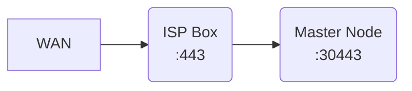

# MBCaaS

My self hosted Kubernetes cluster.

## Hosted Domain

michalski.fr | mbcaas.com

> Managed by [cloudflare](https://www.cloudflare.com/).

> There is not necessarily a web page on the roots of these domains

## Bare Metal

### Hardware
This single node cluster running on a mini pc bought on amazon : [amazon link](https://www.amazon.fr/gp/product/B0919ZGR1R)

| <!-- -->    | <!-- -->    |
|---|---|
| CPU | Intel Core I5-8279U - 4 Cores /  8 Threads |
| GPU | Intel Iris Plus Graphics 655 |
| Memory | 16Gb DDR4 - 2 x 8Gb |

I hope i can add few node to this cluster along time. I don't have and probably never will have the need for it but it's just for fun.

### OS

For the opérating system i chose Ubuntu 20.04.3 LTS x86_64, for multiple reason.
First, the ease of installation, download ISO, copy it on my [Ventoy](https://www.ventoy.net/en/index.html) usb key, start my computer and chose ubuntu in the boot menu. After that the ubuntu installer will do the glue.

The seconds reason is: i'm a really lazy. For my needs, i found all code for install docker / kubernetes on ansible galaxy.
And when i say "ansible galaxy", i mean [Jeff Geerling](https://github.com/geerlingguy). Why spend time writing code when much more competent guys share theirs?
Thanks for your work.
When i start this project, it seems to me that the roles I needed recommended to use Ubuntu Focal. But maybe it's not true and I chose this distribution arbitrarily.

### Provisioning

For the hardening of my cluster i wrote a [hardening ansible role](infrastructure/bare-metal/roles/hardening) that handle following stuff:

- System upgrade
- Server Timezone
- SSH user and private key
- Disks Partitions
- SWAP ( disable for kubernetes )
- Install some usual tools I use like `jq`.

And an [ansible playbook](./infrastructure/bare-metal/playbook/infrastructure.yml) that launch the following role:

- My custom hardening role
- [geerlingguy.nfs](https://github.com/geerlingguy/ansible-role-nfs)
- [geerlingguy.docker](https://github.com/geerlingguy/ansible-role-docker)
- [geerlingguy.helm](https://github.com/geerlingguy/ansible-role-helm)
- [geerlingguy.kubernetes](https://github.com/geerlingguy/ansible-role-kubernetes)

For the 3 first role, the default value work well for me, but for kubernetes install I need to change some parameters.
In my case, you can find my parameters in [this files](./infrastructure/bare-metal/playbook/group_vars/all/kubernetes.yml).
This is probably not following all the best practice, but it's working for me like that.
For all your case, use the [Kubernetes documentation](https://kubernetes.io/docs/home/)

### Self hosted consideration

The goal of this self hosted cluster, it's to give me the opportunity to build web server from scratch (Playing first and foremost in reality).
Like all Internet Service Provider, my ISP give me a public IP on WAN, i can found this IP in my router configuration interface.
For now when i call this ip, nothing respond me. I need to set up à port forwarding between my ISP box and my single node.
In my case, and because i user my ISP box on `router` mode and not as `bridge` with some professional router behind, this step is manual and can be done on my ISP router configuration interface. For the moment i just want to allow HTTPS flow, so i open the port `443` of my box and forward it to my home server.

For test this forwarding run `python -m http.server 30443` in some directory, open your web browser and type `http://{YOUR_ISP_BOX_PUBLIC_IP}:443`, you will see the content of the folder where you launch the pytho n http.server module.

## Kubernetes Cluster

So now, with some skills and Geerlingguy help, i have a single node raw Kubernetes nodes. The objective is now to set up an ecosystem allowing me to quickly expose web applications. I'm not going to invent anything, I'll just use existing software.

### Deployment

To deploy workload on kubernetes we can use `kubectl` command to apply `manifest` but most popular kubernetes software provide `helm chart`, which is a collection of manifest template. This second approach is useful for customize some parameters of deployed manifest.

But as said above, i need different software and sometime they have to shared commons variables. For this reason I use [Helmfile](https://github.com/roboll/helmfile) that allow me to define custom value file for each helm chart.

You can found all the chart I use in my [helmfile.yaml](./kubernetes/helmfile.yaml).

### Container Storage Interface

Do to the nature of docker, when a container re-start, all the files that not in the source image or in a `volume` will be deleted.
By designed, kubernetes can restart container/pod for me, if they are unhealthy or for rescheduling (not on single note cluster).
Container stop and start is also operated during application update.

For allowing keep your data after container restart, kubernetes volume can be use, and the most basics one is the `hostPath` volume that bind one path of your host inside your container. But some [Container Storage Interface](https://kubernetes.io/blog/2019/01/15/container-storage-interface-ga/) come with most advanced feature like backup and replication.

All Clouds provider provide their own solution, but cause I'm on bare-metal infrastructure I have do install my own CSI. After some research, I retain 2 open-source candidate, [minio](https://min.io/) and [longhorn](https://longhorn.io/). Minio look more popular and maybe offer more feature, but it look more complex too. I chose longhorn. It offer me dynamic storage solution with backup,snapshot and replication for when I have more than one node.

> Longhorn useful link :
> [Longhorn git repository](https://github.com/longhorn/longhorn) |
> [Longhorn helm chart](https://github.com/longhorn/charts) |
> [My values](./kubernetes/modules/longhorn.gotmpl)

### Ingress Controller

Now i have a Kubernetes Cluster with dynamic storage enable, but nothing listening port `30443` of my master node.

This is the role of Ingress Controller, it's listen on node port, and forward request based on Ingress rules like domain or path matching.

Several [Ingress Controller](https://kubernetes.io/docs/concepts/services-networking/ingress-controllers/) can be use, i start with [nginx](https://docs.nginx.com/nginx-ingress-controller/intro/overview/) but a few moment later I switch to [Traefik](https://doc.traefik.io/traefik/providers/kubernetes-ingress/) for his user friendly dashboard and for his [middleware](https://doc.traefik.io/traefik/middlewares/overview/) concept. With Traefik middleware, i can easily setup whitelist or blacklist, limit request rate or add basic-auth for my ingress.

Another very comfortable functionality provided by Traefik is the certificate management: I delegate him the generation and renewal of my domains certificates.
This is mandatory for use cloudflare in full encryption proxy mode.

> Traefik useful link:
> [Traefik git repository](https://github.com/traefik/traefik) |
> [Traefik helm chart](https://github.com/traefik/traefik-helm-chart) |
> [My values](./kubernetes/modules/traefik.gotmpl)

### Observability

Now before deploy any application, i must have monitoring system to help me debugging and troubleshoot.

For metrics [Prometheus](https://prometheus.io/) is one of the most popular tools and the kubernetes community seems to have adopted it.
Like other kubernetes tools, prometheus provide an helm chart named `kube-prometheus-stack` with a lot of tools embedded like prometheus database, custom resource definition (CRD) like `ServiceMonitor`, [Alertmanager](https://prometheus.io/docs/alerting/latest/alertmanager/) for fire alerts and [Grafana](https://grafana.com/) for render chart.

For logs, I hesitated between a lot of stack : [ELK](https://www.elastic.co/what-is/elk-stack), [Fluentbit](https://docs.fluentbit.io/manual/), but finally i chose [Loki](https://grafana.com/oss/loki/) and [Promtail](https://grafana.com/docs/loki/latest/clients/promtail/).
Elastic and Kibana are very powerful tools but expensive in resources. I don't need indexing or parsing of my logs, a simple centralization with the possibility to do raw search in it is largely enough for my need. Here is what guided my choice, the lightness of Loki and Promtail. Like other tools, grafan provide a helm chart for that.

> Prometheus useful link:
> [Prometheus git repository](https://github.com/prometheus/prometheus) |
> [Prometheus-stack helm chart](https://github.com/prometheus-community/helm-charts/tree/main/charts/kube-prometheus-stack) |
> [My values](./kubernetes/modules/prometheus-stack.gotmpl)

> Loki useful link:
> [Loki git repository](https://github.com/grafana/loki) |
> [Loki-stack helm chart](https://github.com/grafana/helm-charts/tree/main/charts/loki-stack) |
> [My values](./kubernetes/modules/loki-stack.gotmpl)
