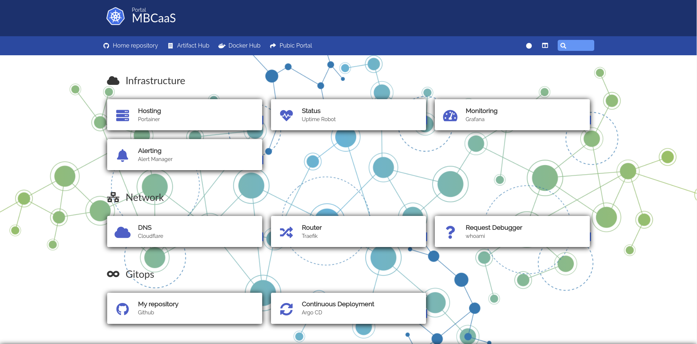

# Home

Ansible project for my home kubernetes.




## Playbook

- `playbook/infrastructure.yml`: it allows the configuration and deployment of my home kubernetes cluster.
- `playbook/applications.yml`: deploy all my apps on kubernetes cluster

## How to use it

Install requirements:

```bash
ansible-galaxy install -r requirements.yml
```

Launch playbook:

```bash
ansible-playbook --inventory inventories/prod/hosts playbook/infrastructure.yml --vault-pass-file ./pwd.vault
ansible-playbook --inventory inventories/prod/hosts playbook/applications.yml --vault-pass-file ./pwd.vault
```

## Infrastructure playbook tags list in execution order

|     Tag Name                      | What it does    |
|     ---                           | ---               |
|     **HARDENING**                 |                   |
|     hardening::users              |  Manage users, privileges and ssh keys |
|     hardening::timezone           |  Set Timezone to Europe/Paris |
|     hardening::upgrade            |  Updating system packages and removing unnecessary ones |
|     hardening::partition          |  Manage disks, partitions, mountpoint |
|     hardening::backup             |  Deploy backup script |
|     hardening::swap               |  Disable swap (kubernetes prerequisite) |
|     hardening::usual              |  Installing utilities that I frequently use |
|     ---                           |                   |
|     **NFS**                       |  Install nfs server and expose partitions |
|     ---                           |                   |
|     **KUBERNETES**                |                   |
|     kubernetes::cluster           |  Install raw Kubernetes using [geerlingguy's](https://github.com/geerlingguy) roles |
|     kubernetes::core              |  Installation and configuration of my core platform including storage class, metallb, traefik, cert-manager, external-dns, prometheus stack and portainer |
|     kubernetes::data              |  Installation and configuration of shared database. [Documentation](./docs/database.md) |
|     kubernetes::gitops            |  Installation and configuration  of gitops part of my plateforme using argocd |
|     kubernetes::portal            |  Intallation of my homelab portal using [homer](https://github.com/bastienwirtz/homer) |


## Home server spécification

My home server is a mini pc bought on amazon : [amazon link](https://www.amazon.fr/gp/product/B0919ZGR1R)

| <!-- -->    | <!-- -->    |
|---|---|
| CPU | Intel Core I5-8279U - 4 Cores /  8 Threads |
| GPU | Intel Iris Plus Graphics 655 |
| Memory | 16Gb DDR4 - 2 x 8Gb |
| OS | Ubuntu 20.04.3 LTS x86_64 |

## Domain

- michalski.fr
- mbcaas.com
- on-mange-quoi.com

Managed by [cloudflare](https://www.cloudflare.com/).

## Usefull link

- [Nginx Ingress controller](https://kubernetes.github.io/ingress-nginx/)
- [Nginx ingress controller - baremetal considerations](https://kubernetes.github.io/ingress-nginx/deploy/baremetal/)
- [Metallb installation](https://metallb.universe.tf/installation/)
- [External-dns](https://github.com/kubernetes-sigs/external-dns)
- [External-dns with Cloudflare](https://github.com/kubernetes-sigs/external-dns/blob/master/docs/tutorials/cloudflare.md)
- [Cloudflare token generation](https://support.cloudflare.com/hc/fr-fr/articles/200167836-Gestion-des-jetons-et-cl%C3%A9s-de-l-API#12345680)
- [Force External-dns to target my internet box public IP](https://github.com/kubernetes-sigs/external-dns/blob/master/docs/faq.md#are-other-ingress-controllers-supported)
- [Cert Manager install](https://cert-manager.io/docs/installation/)
- [Cert Manager LetsEncrypt ACME](https://cert-manager.io/docs/configuration/acme/)
- [Cert Manager DNS01 Challenge with cloudflare](https://cert-manager.io/docs/configuration/acme/dns01/cloudflare/)
